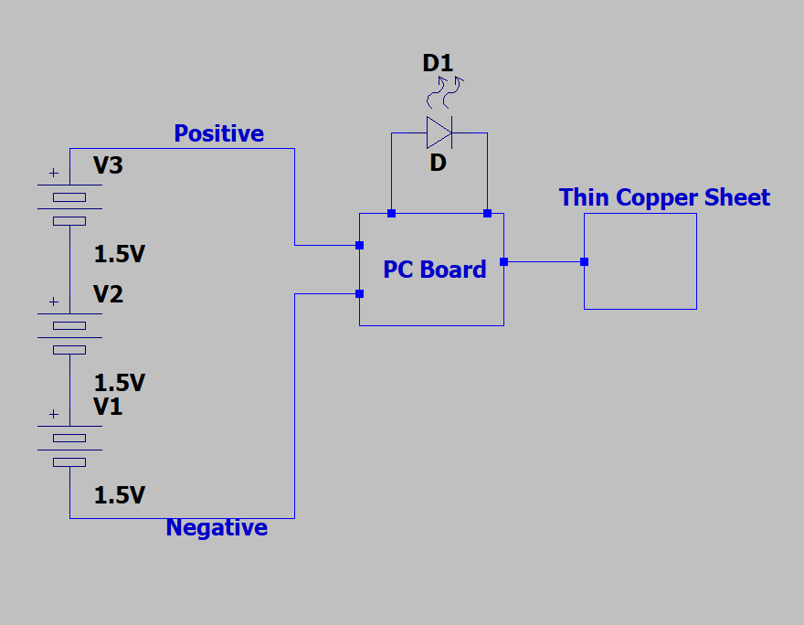
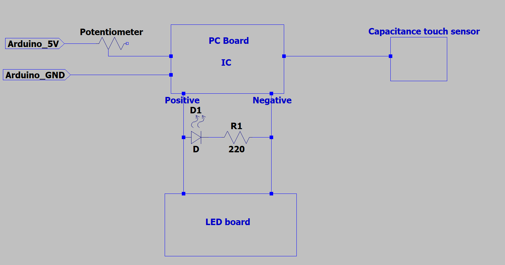

# IDD-Fa18-Lab1: Blink!

**A lab report by Frans Fourie. Student**

## Part A. Set Up a Breadboard


## Part B. Manually Blink a LED

**a. What color stripes are on a 100 Ohm resistor?**

1st Band - Brown = 1
2nd Band - Black = 0
3rd Band- Multiplier - Brown = 10
4th Band Tolerance can be one of a few things such as Gold or Silver

 
**b. What do you have to do to light your LED?**

Connect the one pin of the Push Button to 5V.
Connect the other pin of the Push button (Switched with the first pin) to the positive leg of the LED.
Connect the Negative leg of the LED to a resistor such as (220 Ohm).
Connect the other leg of the resistor to the negative rail of the bread board.
Connect the positive rail of the bread board to the 5V pin of the Arduino.
Connect the negative rail of the bread board to the ground pin of the Arduino.
Supply power to the Arduino and then while the button is pushed the LED is lit.


## Part C. Blink a LED using Arduino

### 1. Blink the on-board LED

**a. What line(s) of code do you need to change to make the LED blink (like, at all)?**

Did not have to change anything the example already used LED_BULTIN which was automatically detected and configured to the correct pin for the board. The following example code was used to blink the LED on the Arduino.

**b. What line(s) of code do you need to change to change the rate of blinking?**

Change the values in the Delay() functions. In the example the top delay specifies how long the LED stays on for in milliseconds and the bottom one specifies how long it is off for.


**c. What circuit element would you want to add to protect the board and external LED?**

You would put a resistor in series with the external LED.
 
**d. At what delay can you no longer *perceive* the LED blinking? How can you prove to yourself that it is, in fact, still blinking?**

I can see the LED blinking at 20 ms still but when it gets below 15ms i can no longer see it with the naked eye. But if you open your phones camera and look at the LED thru the camera you can clearly still see it blinking.


**e. Modify the code to make your LED blink your way. Save your new blink code to your lab 1 repository, with a link on the README.md.**


``` Arduino
void setup() {
  // initialize digital pin LED_BUILTIN as an output.
  pinMode(LED_BUILTIN, OUTPUT);
}

// the loop function runs over and over again forever
void loop() {
  digitalWrite(LED_BUILTIN, HIGH);   // turn the LED on (HIGH is the voltage level)
  delay(100);                       // wait for a second
  digitalWrite(LED_BUILTIN, LOW);    // turn the LED off by making the voltage LOW
  delay(100);                       // wait for a second
  digitalWrite(LED_BUILTIN, HIGH);   // turn the LED on (HIGH is the voltage level)
  delay(100);                       // wait for a second
  digitalWrite(LED_BUILTIN, LOW);    // turn the LED off by making the voltage LOW
  delay(100);                       // wait for a second
  digitalWrite(LED_BUILTIN, HIGH);   // turn the LED on (HIGH is the voltage level)
  delay(100);                       // wait for a second
  digitalWrite(LED_BUILTIN, LOW);    // turn the LED off by making the voltage LOW
  delay(100);                        // wait for a second
  digitalWrite(LED_BUILTIN, HIGH);   // turn the LED on (HIGH is the voltage level)
  delay(1000);                       // wait for a second
  digitalWrite(LED_BUILTIN, LOW);    // turn the LED off by making the voltage LOW
  delay(1000);                       // wait for a second
  digitalWrite(LED_BUILTIN, HIGH);   // turn the LED on (HIGH is the voltage level)
  delay(1000);                       // wait for a second
  digitalWrite(LED_BUILTIN, LOW);    // turn the LED off by making the voltage LOW
  delay(1000);                       // wait for a second
}
```


### 2. Blink your LED

**Make a video of your LED blinking, and add it to your lab submission.**

https://youtu.be/AAdBxs8UqfY


## Part D. Manually fade an LED

**a. Are you able to get the LED to glow the whole turning range of the potentiometer? Why or why not?**

Yes, It glows the entire range because even with the potentiometer set max resistance combined with the 220 Ohm resistor there is still current in the circuit it is just very small but is enough to make the LED give off a faint visible light.    


## Part E. Fade an LED using Arduino

**a. What do you have to modify to make the code control the circuit you've built on your breadboard?**

I changed the LED pin from pin 9 to pin 11 on which my LED was connected. 

**b. What is analogWrite()? How is that different than digitalWrite()?**

The analogWrite() function writes a analog value which can be seen as a PWM wave to a pin. The digitalWrite() pin writes either High or Low to an output pin which is basically either 5V or GND. So the digitalwrite can be used to turn on and of an LED whereas the analogwrite can be used to fade an LED by using PWM.


## Part F. FRANKENLIGHT!!!

### 1. Take apart your electronic device, and draw a schematic of what is inside. 



**a. Is there computation in your device? Where is it? What do you think is happening inside the "computer?"**

Yes, On the PCB there is a small IC. The IC checks for when the capacitance button is touched. When the Touch pad is touched the IC turns on or off the power to the LED Lights.

**b. Are there sensors on your device? How do they work? How is the sensed information conveyed to other portions of the device?**

Yes, there is a capacitance touch sensor. When you touch the sensor, you change the capacitance value of the sensor and this value is monitored by the IC. So, when there is a change in capacitance the IC knows that the sensor has been touched and thus to turn on or of the light.

**c. How is the device powered? Is there any transformation or regulation of the power? How is that done? What voltages are used throughout the system?**

The system makes use of AA batteries. The system has a battery holder that houses 3 AA batteries in series. Since each batterie is 1.5V the system has an operational voltage of +-4.5V. There is no transformation or regulation that happens in the system.

**d. Is information stored in your device? Where? How?**

There is no information stored in the system. Each time it loses power and power is then returned the light is in an off state which must be the default state of the IC in which it starts when receiving power.

### 2. Using your schematic, figure out where a good point would be to hijack your device and implant an LED.

I received the light in a completely disassembled and broken state with nothing connected anymore. It was thus hard and impractical to use the batteries and batterie housing. So after figuring out how the original light worked and which wire was which I firstly reconstructed the Original light using its components and giving it a 5V supply voltage from my bread board. I then proceeded to insert a potentiometer between the 5V power supply of the bread board and the IC. I then connected the output power from the IC back to the other sides rails of my bread board meaning that the capacitance touch sensor would turn on and of power to the other side power rail of my bread board. I then connected my own LED to the second power rail that receives its power from the PCB. I connected my LEDs' positive leg to the positive side rail and then the negative leg to a resistors one leg and the other leg of the resistor to the negative rail. I then had two jumper cables inserted into the rail that i used to give power again to the original LED board from the light. I could then switch on and off the LED board as well as my own LED using the Capacitive touch sensor and by turning the potentiometer I could dim and bright my LED and the LED boards lights.

### 3. Build your light!

Video of the system working there are points where the lights go off when they should not this is due to the negative wire from the IC to the bread board being loose and not making good contact. The wire is just lying on the correct pad.

https://youtu.be/7ssZgibVroI

The next picture is a schematic of my Frankenlight.



The next image is of my total Frankenlight.


The next image is a close up of the Bread board part of the Frankenlight.


The next image is a close up of the LED board and the PCB with the IC on it.


